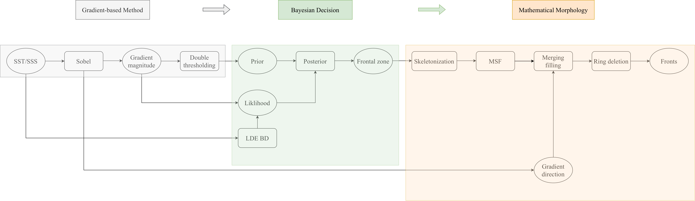
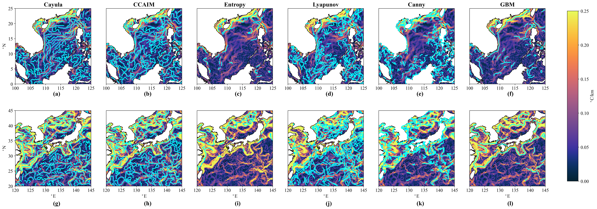

# GBM: Gradient-Bayesian-Morphology Framework

Official implementation of:

W. Wang et al.,

**GBM: An Ocean Front Detection Framework**,

_IEEE Transactions on Geoscience and Remote Sensing_, 2026.

DOI: 10.1109/TGRS.2026.3660295

---

## Overview

GBM (Gradient-Bayesian-Morphology) is a physically informed and fully interpretable framework for ocean front detection.

The framework integrates three complementary components:

* **Gradient-based thresholding** with physically meaningful priors emphasizing sharp field transitions
* **Bayesian inference** that combines gradient priors with local field descriptors for adaptive, data-driven frontal classification
* **Morphological and graph-based refinement** procedures to enforce topological consistency by thinning frontal zones, merging fragmented segments, and removing spurious ring structures

The proposed method suppresses over-detection, reduces false positives, and improves spatial continuity while maintaining robustness, reproducibility, and physical interpretability.

<p align="center">
  
</p>

---

## Key Features

* Physically guided gradient prior
* Adaptive Bayesian classification without fixed threshold tuning
* Morphological thinning and fragment merging
* Systematic removal of spurious ring structures
* Stable performance across weak and strong frontal regimes
* Vectorized frontal extraction and GeoJSON export
* Multi-variable support for SST and SSS fields

---

## Data

The framework was evaluated using daily:

* Sea Surface Temperature (SST)
* Sea Surface Salinity (SSS)

over:

* South China Sea (weak frontal regime)
* Kuroshio region (strong frontal regime)

Input data should be placed in:

```text
./data/
```

The supported input format is NetCDF (`.nc`).

Users can modify the target study region and related parameters directly in the `main.py` configuration variables.

---

## Installation

Install required dependencies:

```bash
pip install -r requirements.txt
```

All required Python packages are listed in:

```text
./requirements.txt
```

---
## Project Structure

```text
GBM/
├── data/                              # Input NetCDF data
├── outputs/
│   ├── SouthChinaSea/
│   │   └── GBM/
│   │       ├── SST/
│   │       │   ├── feature/
│   │       │   ├── gradient/
│   │       │   └── vector/
│   │       └── SSS/
│   │           ├── feature/
│   │           ├── gradient/
│   │           └── vector/
│   │
│   └── Kuroshio/
│       └── GBM/
│           ├── SST/
│           │   ├── feature/
│           │   ├── gradient/
│           │   └── vector/
│           └── SSS/
│               ├── feature/
│               ├── gradient/
│               └── vector/
│
├── main.py
├── requirements.txt
├── flowchart-detection.png
├── comparison_case.png
└── README.md
```

where:

* `feature/` stores frontal feature products
* `gradient/` stores gradient-related intermediate fields
* `vector/` stores vectorized frontal GeoJSON outputs
* `SST/SSS` represent different ocean variables
* `SouthChinaSea/Kuroshio` represent different study regions

---

## Output Files

The framework organizes outputs hierarchically by:

```text
Region → Method → Variable → Output Type
```

For example:

```text
SouthChinaSea/GBM/SST/feature/
```

stores SST frontal feature products for the South China Sea.

---

### 1. feature/

Stores frontal feature products in NetCDF format, including:

* frontal zones
* frontal lines
* frontal length
* frontal width
* frontal intensity

Output format:

```text
NetCDF (.nc)
```

---

### 2. gradient/

Stores gradient-related intermediate fields in NetCDF format, including:

* gradient magnitude
* original input fields

Output format:

```text
NetCDF (.nc)
```

---

### 3. vector/

Stores vectorized frontal products in GeoJSON format, including:

* frontal vector lines

Output format:

```text
GeoJSON (.geojson)
```

---

## Usage

Run the detection framework:

```bash
python main.py
```

Users can modify:

* target ocean region
* input file paths
* variable selection
* detection parameters

directly inside `main.py`.

---

## Detection Results

Jan 1, 2025 SST detection results for different methods:

<p align="center">
  
</p>

---

## Citation

If you find this work useful, please cite:

```text
@ARTICLE{11371355,
  author={Wang, Yishuo and Zhou, Muping and Meng, Qicheng and Zhou, Feng and Hu, Zhijun and Zhang, Chengqing and Zhao, Tianhao},
  journal={IEEE Transactions on Geoscience and Remote Sensing}, 
  title={GBM: An Ocean Front Detection Framework}, 
  year={2026},
  volume={64},
  number={},
  pages={1-17},
  doi={10.1109/TGRS.2026.3660295}}
```

---

## Contact

For questions, suggestions, or collaboration:

[wys1998@sjtu.edu.cn](mailto:wys1998@sjtu.edu.cn)
